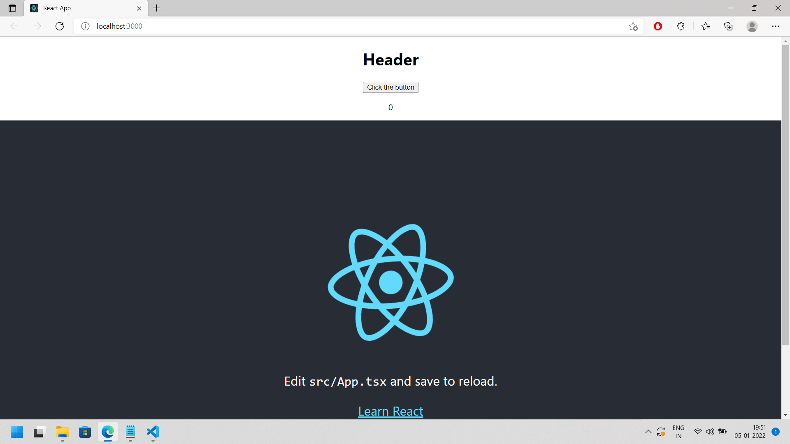

It is just a simple project where you can learn about parent and child function.

-> you can also use https://codesandbox.io/

-> here I have used following commands:

1. commands here used are:

1. npx create-react-app header-button --template typescript
   this command includes app.tsx and react-app-env.d.ts

1. Added my stuff to App.js

1. created styles.css and added some stuff there

1. npm start

screenshot of output:

